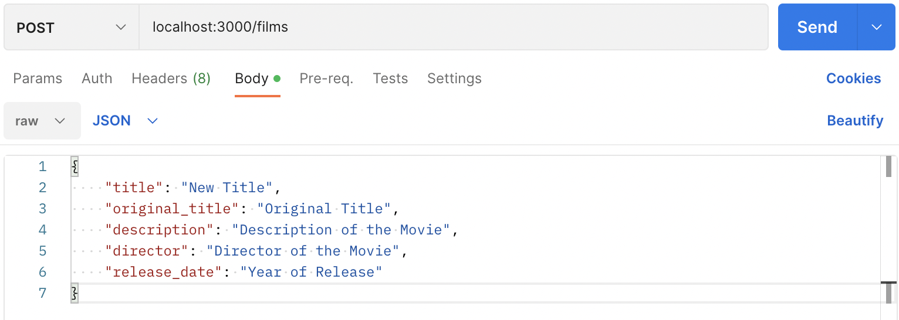
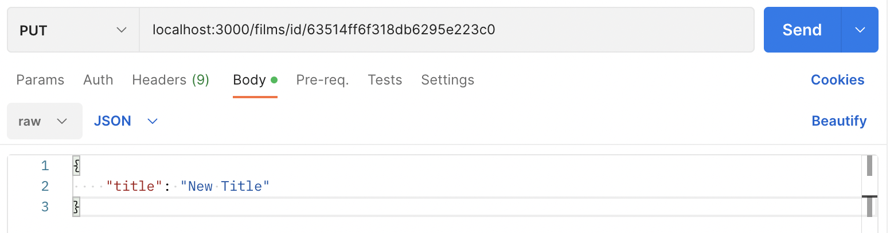
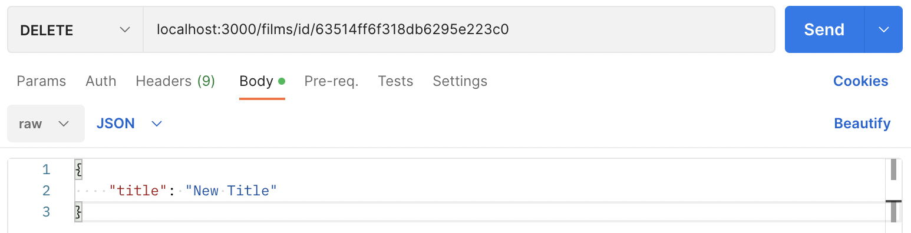

# Studio Ghibli restAPI

### Use for importing information about Studio Ghibli Movies
---

## Get

- base api url: 
  - /films/
- how to access endpoints:
  - to get films: 
    - /films/
  - to get by title: 
    - /films/title/${title}
  - to get by ID: 
    - /films/id/${id}
---

## Create

- send post request to endpoint "/"

---

## Update

- send put request to endpoint "/films/id"
---

## Delete

- send delete request to endpoint "/films/id"
---

- [ ] Deploy
- [ ] finish paths with actual URL

---
##### Made with Mongoose, Express, and JavaScript